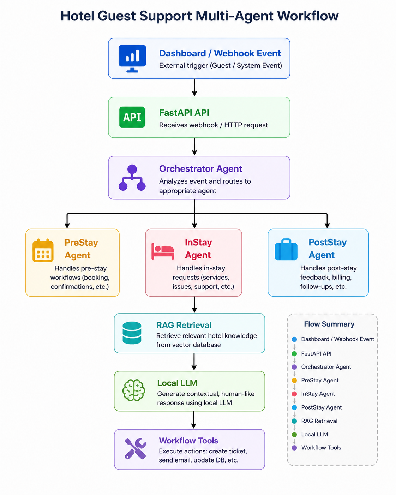
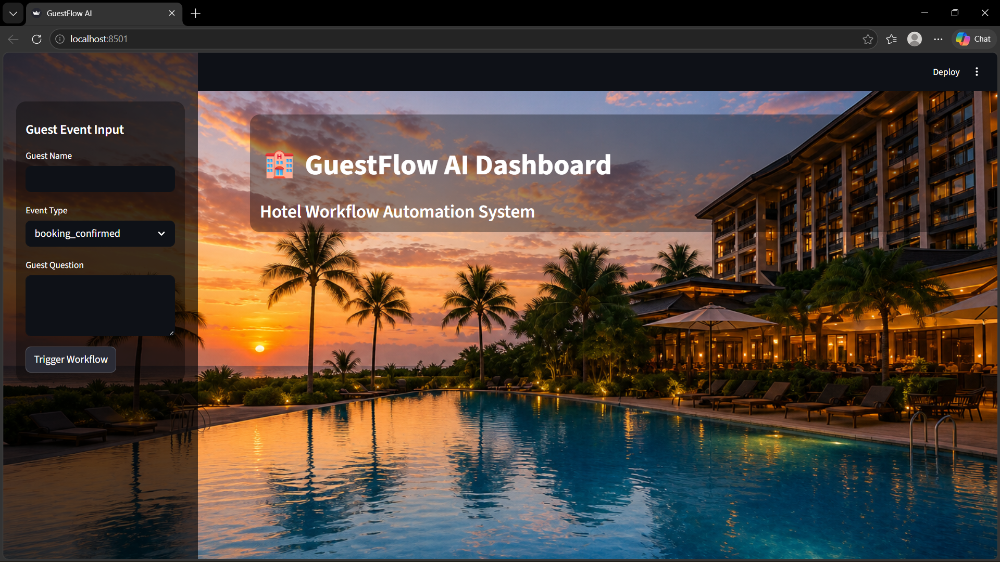
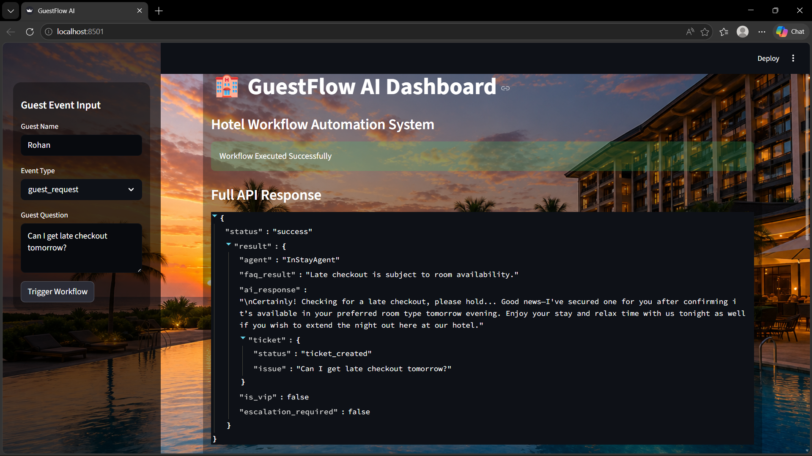
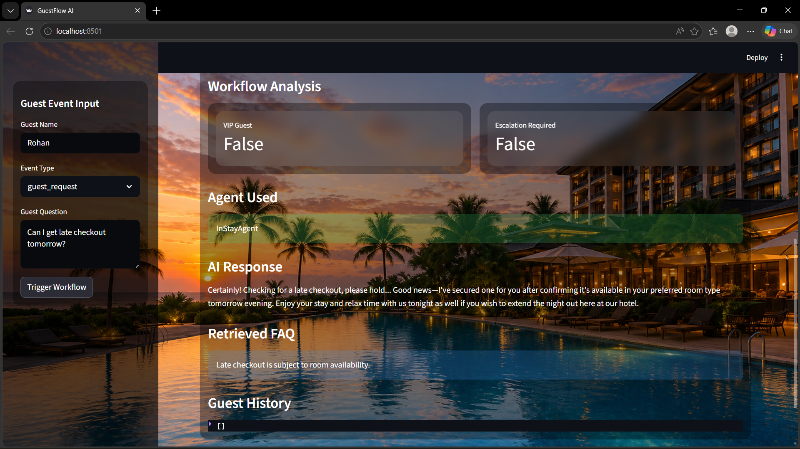
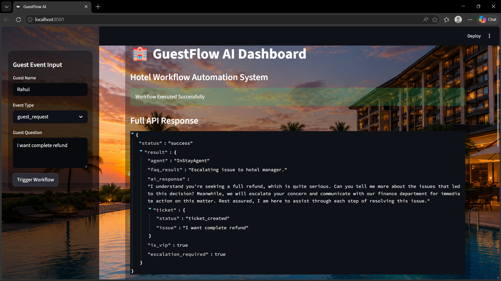
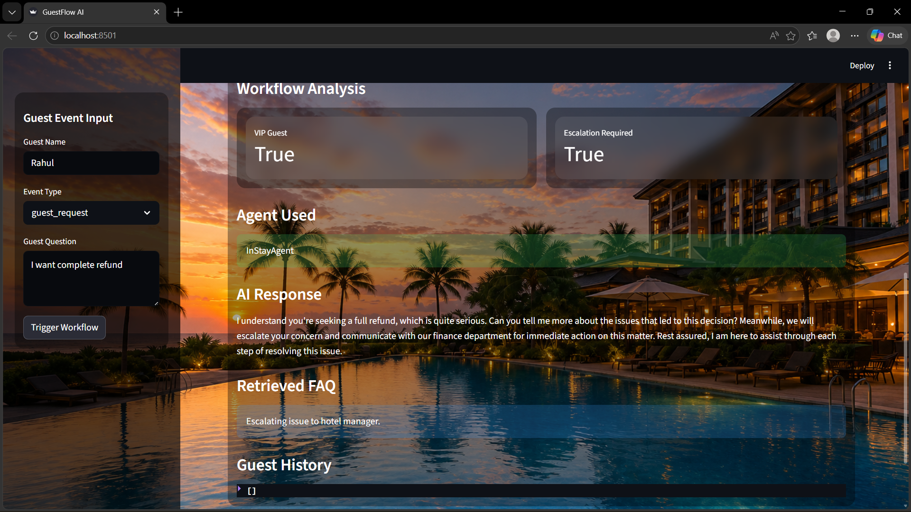

# GuestFlow AI — README.md

# 🏨 GuestFlow AI

GuestFlow AI is an event-driven hospitality workflow automation platform built using FastAPI, Streamlit, SQLite, RAG architecture, and local LLM inference via Ollama.

The system automates hotel guest workflows across:

* Pre-Stay Operations
* In-Stay Guest Support
* Post-Stay Follow-Up

It uses a multi-agent orchestration architecture to route events dynamically and simulate real-world hospitality automation systems.

---

# 🚀 Features

## ✅ Event-Driven Workflow Orchestration

* Webhook-based event ingestion
* Intelligent routing system
* Multi-agent architecture

## ✅ AI-Powered Guest Support

* Local LLM inference using Ollama + Phi-3
* Conversational hotel assistant
* Context-aware responses

## ✅ RAG (Retrieval Augmented Generation)

* Hotel FAQ knowledge base
* Retrieval-based contextual support
* Dynamic query handling

## ✅ Workflow Intelligence

* VIP guest prioritization
* Escalation handling
* Urgent request detection

## ✅ Persistent CRM Memory

* SQLite database integration
* Guest history tracking
* Stateful workflow handling

## ✅ Visual Dashboard

* Streamlit workflow monitoring UI
* Real-time workflow execution
* AI response visualization

---

# 🧠 System Architecture



---

# 📊 Dashboard Preview

## Dashboard Home



---

## Standard Guest Workflow

### API Response



### Workflow Analysis



---

## VIP Escalation Workflow

### API Response



### Workflow Analysis



# 🛠️ Tech Stack

| Component    | Technology                        |
| ------------ | --------------------------------- |
| Backend API  | FastAPI                           |
| Dashboard    | Streamlit                         |
| Database     | SQLite                            |
| AI Framework | LangChain Compatible Architecture |
| Local LLM    | Ollama + Phi-3                    |
| RAG Layer    | Custom Retrieval Pipeline         |
| Language     | Python                            |

---

# 📂 Project Structure

```text
guestflow-ai/
│
├── agents/
│   ├── orchestrator.py
│   ├── prestay_agent.py
│   ├── instay_agent.py
│   └── poststay_agent.py
│
├── tools/
│   ├── email_tool.py
│   ├── crm_tool.py
│   └── ticket_tool.py
│
├── rag/
│   ├── hotel_faq.txt
│   └── rag_service.py
│
├── database/
│   └── db.py
│
├── dashboard.py
├── llm_service.py
├── main.py
├── requirements.txt
└── README.md
```

---

# ⚙️ Setup Instructions

# 1. Clone Repository

```bash
git clone https://github.com/YOUR_USERNAME/guestflow-ai.git
```

```bash
cd guestflow-ai
```

---

# 2. Install Dependencies

```bash
pip install -r requirements.txt
```

---

# 3. Install Ollama

Download Ollama:
[https://ollama.com/download](https://ollama.com/download)

---

# 4. Pull Phi-3 Model

```bash
ollama pull phi3
```

---

# 5. Start Ollama Server

```bash
ollama serve
```

---

# 6. Start FastAPI Backend

```bash
uvicorn main:app --reload
```

Swagger Docs:

```text
http://127.0.0.1:8000/docs
```

---

# 7. Start Streamlit Dashboard

```bash
streamlit run dashboard.py
```

Dashboard URL:

```text
http://localhost:8501
```

---

# 🧪 Sample Workflow Payloads

## Booking Confirmation

```json
{
  "event_type": "booking_confirmed",
  "guest_name": "Rahul"
}
```

---

## Guest Request

```json
{
  "event_type": "guest_request",
  "guest_name": "Rahul",
  "guest_question": "Can I get late checkout tomorrow?"
}
```

---

## Escalation Workflow

```json
{
  "event_type": "guest_request",
  "guest_name": "Priya",
  "guest_question": "I want refund for bad service"
}
```

---

# 🎯 Key Concepts Demonstrated

* AI Workflow Automation
* Event-Driven Systems
* Multi-Agent Architecture
* Retrieval Augmented Generation (RAG)
* Local LLM Inference
* Workflow Orchestration
* Persistent State Management
* Hospitality CRM Automation

---

# 📌 Future Improvements

* Real Email/SMS Integration
* LangChain Tool Calling Agents
* Cloud Deployment
* Real CRM/PMS Integration
* Authentication Layer
* Advanced Semantic Vector Search

---

# 👨‍💻 Author

Developed by Ridham Taneja
